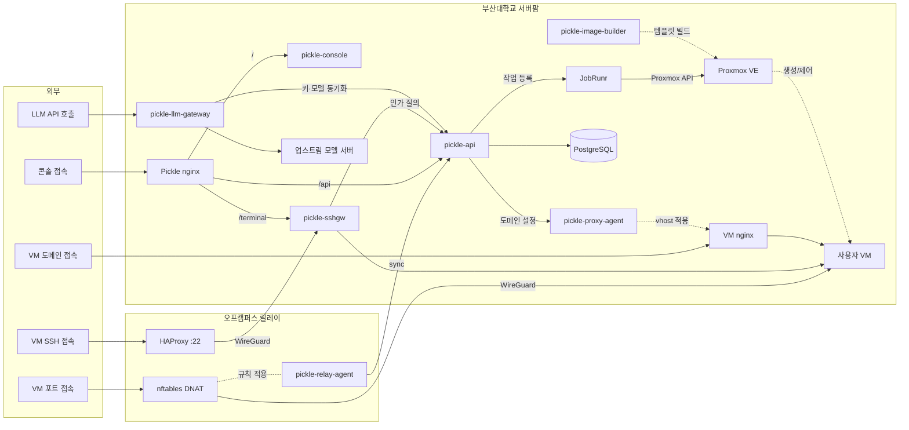

# pickle-api

부산대학교 클라우드 플랫폼(Pickle)의 백엔드 API 서버입니다.

사용자가 웹 콘솔에서 VM이나 LLM API 키를 신청하면 관리자 승인을 거쳐 리소스가
발급됩니다. VM은 Proxmox VE 프로비저닝과 SSH 접속, 도메인 기반 HTTPS 공개, 웹 터미널로
이어집니다. 실제 SSH 종단과 nginx 조작은 각각 게이트웨이와 에이전트가 맡고, 이 서버는
리소스 수명주기 전체에서 무엇을 해야 하는지 정하고 결과를 기록합니다.

접속: https://pickle.pusan.ac.kr

REST API(`/api/v1`), JobRunr 백그라운드 워커, Proxmox REST 클라이언트, 주기 스케줄러가
fat jar 하나로 동작합니다. 상태는 데이터베이스 한 곳에서 관리하며 잡 큐와 IP 할당,
라우팅 정보가 같은 곳에 있습니다.

스택: Spring Boot 4.1 / Java 25 / PostgreSQL 18 / Flyway / JobRunr / springdoc

## 주요 기능

플랫폼은 VM과 LLM API 키의 신청과 승인, 발급부터 사용과 만료, 폐기까지를 다룹니다.
이 레포지토리가 맡는 부분은 아래와 같습니다.

- **프로비저닝 파이프라인**: 승인된 신청을 받아 VM을 만들고 내부 IP와 초기 계정, 접속
  정보까지 준비합니다.
- **LLM API 키 관리**: 승인된 신청에서 키를 만들고 발급과 한도, 정지, 재개, 폐기 상태를
  관리합니다. 관리자 조회는 기관별 역할 범위로 제한하며, 7·30·90일 수요와 주요 소비처,
  실제 한도 차단, usage 전달 신뢰도를 DB cache에서 함께 조회합니다.
- **기관별 OpenRouter 사업 account**: 한 기관이 사업별 account를 여러 개 등록하고,
  검증된 management credential을 staged overlap으로 교체합니다. 금액 축 key는 승인 시 한
  account에 불변 binding되며, 그 account의 credential 말고 쓸 수 있는 관리 자격증명은
  없습니다.
- **LLM 서비스 관측**: 게이트웨이의 5초 sync 자기보고에서 upstream별 실제 요청 상태와
  별도 `/models` probe, catalog 비교, usage 전송 queue를 현재 상태로 저장합니다. 관리자
  `GET /api/v1/admin/llm/status`와 `/metrics`는 DB와 raw usage event만 읽으며 upstream을
  직접 호출하거나 routing을 바꾸지 않습니다. 지표는 event에 기록된 마지막 처리 upstream의
  최종 결과이므로 중간 retry 경로나 uptime으로 해석하지 않습니다.
- **인가 판정과 감사**: 리소스마다 붙는 접근 목록으로 그 리소스의 접근을 판정하고, 되돌릴 수 없는 작업은
  영구 기록으로 보존합니다.
- **계정과 인증**: 회원가입, 메일 인증, 2단계 인증을 담당합니다. 계정 상태가 바뀌면
  살아 있는 세션과 게이트웨이 접근이 함께 회수됩니다.
- **수명주기 관리**: 사용 기간이 끝나가면 미리 알립니다. 만료된 VM은 데이터를 남긴 채
  종료되고, 삭제는 유예와 보호 게이트를 거칩니다.
- **드리프트 감시**: 기록된 상태와 하이퍼바이저의 실제 상태가 어긋나면 찾아내 관리자
  화면에 올립니다. 스스로 고치거나 지우지 않습니다.
- **알림**: 승인, 만료 임박, 프로비저닝 결과 같은 사건을 콘솔 알림함에 쌓고 메일로도
  내보냅니다.
- **공지사항**: 팝업으로 띄울지가 로그인 없이 보이는지까지 함께 정합니다. 팝업으로 올린
  공지는 방문자에게 바로 열리고, 나머지는 로그인한 사용자의 게시판에 남습니다. 볼 수 없는
  공지는 거절이 아니라 404로 답합니다. 본문 이미지는 클라이언트가 선언한 형식이 아니라
  실제 바이트로 판별해 받습니다(PNG·JPEG·WebP·GIF, 한 장 2 MiB, 공지당 5장). 점검
  모드에서도 계속 읽힙니다.

## 동작 방식

- **Proxmox 클라이언트**를 이 레포지토리에서 직접 구현합니다. 실제 서버 응답을 캡처해 둔
  WireMock 테스트로 응답 명세를 고정해 검증합니다.
- **잡 큐가 데이터베이스에 있습니다.** JobRunr가 잡을 PostgreSQL 테이블에 저장하므로
  최소 1회 실행과 백오프 재시도, 진행 상황 대시보드가 따라옵니다. 워커는 API와 같은 JVM에서
  돌고, 부하가 늘면 같은 jar를 `--worker-only` 모드로 다른 호스트에 띄울 수 있습니다.
- **민감한 작업에는 인증이 한 겹 더 있습니다.** 비밀번호 열람이나 키 다운로드처럼
  되돌리기 어려운 작업은 로그인 상태여도 짧은 유효기간의 재인증 토큰을 다시 요구하며,
  인터셉터가 대상 작업 전체에 일괄 적용합니다. 회원가입 비밀번호는 유출 이력 차단목록과
  대조합니다.
- **권한 매트릭스를 테스트가 강제합니다.** 운영자가 확정한 역할×기능 매트릭스 YAML과
  실제 엔드포인트 인가 설정을 `PermissionMatrixTest`가 1:1로 대조합니다.
- **책임 경계** — 이 서버는 SSH 연결을 열지 않습니다. 웹 터미널은 별도 브리지가
  담당하고, 필요한 OpenSSH 공개키 파싱과 키쌍 생성은 와이어 포맷을 직접 다룹니다.
- **자격증명 문제는 기동에서 걸러냅니다.** 데이터베이스 비밀번호, JWT 서명 키, 자격증명
  암호화 키, 내부 토큰 중 하나라도 비어 있으면 서버가 실행되지 않습니다.
- **테스트가 외부 런타임을 요구하지 않습니다.** Zonky embedded-postgres와 WireMock으로
  돌기 때문에 `mvn verify` 하나로 전체 테스트가 끝납니다.

## 프로비저닝 파이프라인

승인 트랜잭션이 VM 행(CREATING)을 만들고 잡을 큐에 넣으면 워커가 아래 단계를 순서대로
지나갑니다.

```
guard → 노드 배치 → IP 할당 → VMID 채번 → OS 이미지 clone
  → 설정(사양·cloud-init·고정 IP·protection=1) → 디스크 리사이즈
  → 기동 → qemu-agent 검증 → 호스트키 수집 → 완료(RUNNING, 알림)
```

각 단계는 멱등이라 중간에서 다시 시작해도 안전합니다. 백오프 재시도로도 통과하지
못하면 보상 로직이 만들어 둔 것을 정리하거나, VM을 NEEDS_ADMIN 상태로 두고 관리자
콘솔에 띄웁니다. 어느 경로도 리소스를 자동으로 파괴하지 않습니다.

30초 상태 폴러와 10분 드리프트 리컨실러, 5분 삭제 스위퍼, 10분 고아 태스크 복구가
데이터베이스와 Proxmox를 계속 맞춥니다. 드리프트 리컨실러는 어긋난 지점을 보고만 하고
직접 손대지 않습니다. 관리 대상 VM은 하이퍼바이저 `protection` 플래그를 상시 켜 두고,
의도된 삭제 직전에만 내립니다.

## API 명세

springdoc이 생성한 `contract/openapi.yaml`이 커밋된 as-built 스펙이고, 콘솔의
TypeScript 타입도 이 파일에서 만듭니다. 엔드포인트가 바뀌면 재생성합니다.

```bash
mvn test -Dtest=ContractDriftTest -Dcontract.update=true
```

갱신하지 않으면 `ContractDriftTest`가 빌드를 실패시킵니다. 환경 변수
`PICKLE_CONTRACT_MASTER`에 수기로 쓴 설계 명세 YAML 경로를 주면 설계 표면과 구현 표면의
집합 대조에 더해, 두 문서가 함께 가진 오퍼레이션의 `operationId`와 설계 명세가 붙인
스키마명이 생성본과 같은지까지 대조합니다.

실행 중인 서버도 같은 스펙을 제공합니다: https://pickle.pusan.ac.kr/api/v1/openapi

## 초기 데이터

마이그레이션은 스키마만 담습니다. 노드와 IP 풀, 릴레이, 인증서, OS 이미지, 런타임 설정
값, 약관처럼 배포 환경을 서술하는 행은 마이그레이션에 들어가지 않으므로, 갓 만들어진
데이터베이스는 완전히 빈 채로 시작합니다.

dev와 test 프로파일에서는 시더가 그 자리를 채웁니다. 런타임 설정 전체와 이용약관·
개인정보처리방침 자리표시자 문서, 시스템 관리자와 기관 관리자 계정, 시험용 기관 하나,
그리고 노드와 IP 풀, OS 이미지, 사양 프리셋, 릴레이, 플랫폼 와일드카드 인증서가
들어갑니다. 감사 로그가 비어 있는 데이터베이스에서만 SSH 게이트웨이와 웹 터미널의
킬 스위치도 함께 켭니다. 각 부분은 대상 테이블이 비어 있을 때만 동작하므로 이미 손을
댄 값을 덮어쓰지 않습니다. 로컬에서 별도 준비 없이 신청 화면까지 따라갈 수 있는 것은
이 시더가 미리 채워 두기 때문입니다.

**이 시더는 dev와 test 전용입니다.** `staging`과 `prod`에는 최초 SYS_ADMIN 한 명을 만드는
부트스트랩만 있고, 나머지 행은 운영자 부트스트랩 절차가 넣습니다. 그 절차를 거치기 전의
운영 데이터베이스는 아래 상태입니다.

- 설정 행이 없으면 SSH 게이트웨이와 웹 터미널, 포트 포워딩이 모두 꺼진 것으로 읽혀
  요청이 거부됩니다. 설정 수정 API는 이미 있는 키의 값만 바꾸고 없는 키에는 404로
  답하므로, 빠진 행을 콘솔에서 만들어 넣을 수 없습니다.
- 약관 문서가 없으면 회원가입이 "약관 문서가 준비되지 않았습니다"로 실패합니다.
- 기관이 없으면 VM 신청이 대상 기관을 찾지 못해 거부됩니다.
- 신청 화면의 OS 목록은 활성 상태인 카탈로그 행만 보여줍니다. 상태 전환은 관리자
  API가 담당합니다.

그래서 운영 환경은 부트스트랩 절차를 마친 뒤에야 쓸 수 있습니다. `staging`과 `prod`는 이
절차를 그대로 공유합니다.

### 부트스트랩 관리자 자격

`PICKLE_BOOTSTRAP_ADMIN_EMAIL`과 `PICKLE_BOOTSTRAP_ADMIN_PASSWORD`는 `staging`과 `prod`
기동에서 아래를 모두 통과해야 하고, 하나라도 어긋나면 기동이 중단됩니다. SYS_ADMIN이 이미 있으면 이
단계는 아무것도 하지 않습니다.

- 두 값 모두 비어 있지 않아야 합니다. 이메일이 이미 다른 계정에 쓰이고 있으면 기동을
  거부합니다.
- 비밀번호는 12자 이상이어야 합니다.
- `changeme`, `password`, `admin`, `secret`, `pickle`, `qwerty`, `letmein`, `12345678`
  같은 자리표시자 목록에 걸리지 않아야 합니다. 대소문자는 구분하지 않습니다.
- 회원가입과 같은 비밀번호 정책을 통과해야 합니다. 유출 이력 차단목록과 `pusan`,
  `busan`, `student`, `ubuntu` 같은 플랫폼 연관 단어를 대조하고, 서로 다른 문자가 둘
  이하인 값과 연속된 문자나 숫자로만 이어지는 값, 이메일 아이디를 포함하는 값을
  거부합니다. UTF-8로 72바이트를 넘는 값도 거부합니다.
- 문자 종류 조합 규칙은 없습니다. 길이와 차단목록이 판정 기준입니다.

## 시작하기

JDK 25와 Maven, 로컬 PostgreSQL 18이 필요합니다.

```bash
# 기본 접속 정보가 가리키는 역할과 데이터베이스를 먼저 만듭니다.
sudo -u postgres psql -c "create role pickle login password '<직접 정한 값>'"
sudo -u postgres createdb -O pickle pickle_dev

# 자격증명에는 커밋된 기본값이 없습니다. 로컬 기동 전에 직접 export 하세요.
export PICKLE_DB_PASSWORD=...            # 위에서 역할에 준 값
export PICKLE_JWT_SECRET=...             # 32바이트 이상
export PICKLE_CREDENTIALS_KEY=...        # base64 32바이트
export PICKLE_SEED_SYSADMIN_PASSWORD=...
export PICKLE_SEED_ORGADMIN_PASSWORD=...

mvn spring-boot:run -Dspring-boot.run.profiles=dev   # :8080
scripts/verify.sh        # checkstyle + mvn verify(전체 테스트) + 의존성 감사
```

알아두면 좋은 것들:

- 프로파일을 지정하지 않으면 기동이 실패합니다. `MailSender` 구현이 프로파일 한정이라
  활성 프로파일 없이는 빈을 찾지 못합니다.
- dev 프로파일에서 메일은 실제로 발송되지 않습니다. `MockMailSender`가 본문을 스풀
  파일(`PICKLE_MOCK_MAIL_SPOOL`, 기본 `/var/lib/pickle/mock-mail.log`)에 적으므로,
  회원가입 인증 링크는 거기서 꺼내면 됩니다.
- `users.email` 컬럼이 `citext` 확장을 쓰므로 마이그레이션 역할에 확장 생성 권한이
  필요합니다.

## 구성

관리형 환경에서는 자격증명을 `/etc/pickle/api.env`로 주입합니다. 기동을 좌우하는 것만
추리면 이렇습니다.

| 변수 | 용도 |
|---|---|
| `PICKLE_DB_URL` / `_USER` | PostgreSQL 접속 (기본 `jdbc:postgresql://localhost:5432/pickle_dev`, 사용자 `pickle`) |
| `PICKLE_DB_PASSWORD` | 데이터베이스 비밀번호. 기본값이 없어 비면 기동 실패 |
| `PICKLE_JWT_SECRET` | HS256 서명 키. 없으면 기동 실패 |
| `PICKLE_CREDENTIALS_KEY` | VM 초기 비밀번호 저장용 AES-256-GCM 키. 없으면 기동 실패 |
| `PICKLE_PROXMOX_TOKEN_ID` / `_SECRET` | PVE API 토큰. Proxmox 없는 로컬 개발은 비워 둬도 됩니다 |
| `PICKLE_SSH_PLATFORM_PUBLIC_KEY` | 전 VM에 주입되는 게이트웨이 공개키. 없으면 프로비저닝 중단 |

환경 변수는 아니지만 기동을 좌우하는 호스트 파일이 하나 더 있습니다.

| 파일 | 용도 |
|---|---|
| `/etc/pickle/departments.json` | 소속 학과 목록을 앱에 내장된 것 대신 씁니다. **선택입니다** — 없으면 내장 목록으로 뜨고, 지우면 내장 목록으로 돌아옵니다. 다만 **파일이 있는데 읽을 수 없으면 권한이든 JSON 문법이든 기동을 거부합니다.** 내장 목록으로 조용히 돌아가면 바꿨다고 믿는 목록과 실제가 어긋나고, 증상이 「편집이 아무 일도 안 했다」뿐이기 때문입니다. 형식은 `src/main/resources/departments.json`과 같고, 코드가 중복되면 안 되며 목록에 없는 소속을 담는 `OTHER` 항목이 있어야 합니다 |

<details>
<summary>전체 환경 변수 표 (메일, Proxmox, 내부 연동, 시드 계정)</summary>

### 메일

| 변수 | 용도 | 기본값 |
|---|---|---|
| `PICKLE_VERIFICATION_BASE_URL` | 인증 메일이 링크하는 콘솔 페이지 | `https://pickle.pusan.ac.kr/verify-email` |
| `PICKLE_PASSWORD_RESET_BASE_URL` | 비밀번호 재설정 메일 링크 | `https://pickle.pusan.ac.kr/reset-password` |
| `PICKLE_MOCK_MAIL_SPOOL` | dev 전용 메일 스풀 파일 | `/var/lib/pickle/mock-mail.log` |
| `PICKLE_SMTP_HOST` / `_USERNAME` / `_PASSWORD` | SMTP 접속. staging/prod 전용, 미설정이면 기동 실패 | 없음 |
| `PICKLE_SMTP_PORT` | SMTP 포트(STARTTLS) | `587` |
| `PICKLE_MAIL_FROM` | 수신함에 표시할 발신자. `Pickle <주소>` 형식을 권장합니다. | `PICKLE_SMTP_USERNAME` |

### Proxmox / 프로비저닝

| 변수 | 용도 | 기본값 |
|---|---|---|
| `PICKLE_PROXMOX_CA_CERT` | PVE API 검증용 신뢰 CA PEM 경로 | 없음(JVM 기본) |
| `PICKLE_TERMINAL_PUBLIC_KEY` | 웹 터미널 브리지 공개키. 게이트웨이 키와 따로 폐기 가능 | 없음(경고만) |
| `PICKLE_SSH_HOST` / `PICKLE_SSH_PORT` | 응답에 노출하는 SSH 접속 주소 | 없음 / `0` |
| `PICKLE_MFA_ENFORCE_ADMIN` | 관리자 2FA 등록 강제 | `false` (prod `true`) |
| `PICKLE_BOOTSTRAP_ADMIN_EMAIL` / `_PASSWORD` | staging/prod 최초 SYS_ADMIN. 12자 이상과 비밀번호 정책을 통과해야 기동 | 없음 |
| `PICKLE_JOBRUNR_DASH_*` | JobRunr 대시보드 노출과 basic auth. 활성 상태에서 자격이 비면 기동 거부 | `false` |

### 내부 연동 (게이트웨이, 프록시, 터미널)

| 변수 | 용도 | 기본값 |
|---|---|---|
| `PICKLE_SSHGW_TOKEN` | `/internal` 공유 bearer. 비면 전 요청 거부 | 없음 |
| `PICKLE_SSHGW_SOURCE_IP` | `/internal` 허용 출발지 | `172.30.1.30` |
| `PICKLE_SSHGW_RATE_LIMIT` / `_GLOBAL_RATE_LIMIT` | `/internal` 분당 한도 | `60` / `600` |
| `PICKLE_PROXY_AGENT_URL` / `_TOKEN` | 프록시 에이전트 주소와 bearer | `http://172.30.1.10:9443` / 없음 |
| `PICKLE_TERMINAL_BRIDGE_URL` / `PICKLE_TERMINAL_CONTROL_TOKEN` | 터미널 브리지 제어 주소와 bearer | `http://172.30.1.30:8083` / 없음 |
| `PICKLE_TERMINAL_PER_USER_CAP` / `_PER_VM_CAP` / `_PER_ORG_CAP` | 동시 터미널 세션 상한 | `3` / `5` / `20` |
| `PICKLE_TERMINAL_RATE_LIMIT` | 티켓 발급 분당 한도 | `10` |
| `PICKLE_TERMINAL_SINGLE_INSTANCE` | 기동 시 단일 인스턴스 확인(PG advisory lock) | `true` |
| `PICKLE_PROXY_PUBLIC_IP` | 커스텀 도메인 A 레코드가 가리킬 프록시 공개 IP | `164.125.249.87` |
| `PICKLE_RELAY_SYNC_RATE_LIMIT` | 릴레이별 동기화 분당 한도 | `20` |
| `PICKLE_RELAY_POLL_INTERVAL_SECONDS` | 릴레이 에이전트 폴링 주기(접촉 두절 판정 기준) | `30` |
| `PICKLE_RELAY_FIRST_CONTACT_GRACE_SECONDS` | 활성 릴레이가 첫 동기화 없이 허용되는 시간(초과 시 미접속 알림) | `900` |
| `PICKLE_RELAY_MAX_SYNC_BODY_BYTES` | 동기화 요청 본문 상한 | `1048576` |
| `PICKLE_RELAY_RESTRICTED_SOURCE_IPS` | 릴레이 동기화 경로 외 접근이 차단되는 출발지 목록(쉼표 구분) | `10.100.100.1` |
| `PICKLE_LLM_GATEWAY_TOKEN` / `_PREVIOUS_TOKEN` | LLM 게이트웨이 `/internal/llm` 공유 bearer(교체 중에는 이전 값도 병행 허용). 비면 전 요청 거부 | 없음 |
| `PICKLE_LLM_GATEWAY_SOURCE_IP` | `/internal/llm` 허용 출발지 | `172.30.1.40` |
| `PICKLE_LLM_{SYNC,USAGE,BODIES}_RATE_LIMIT` | `/internal/llm` 하위 경로별 분당 한도(버킷 분리) | `60` / `120` / `120` |
| `PICKLE_LLM_MAX_{SYNC,USAGE,BODIES}_BODY_BYTES` | `/internal/llm` 하위 경로별 요청 본문 상한 | `65536` / `4194304` / `8388608` |
| `PICKLE_OPENROUTER_URL` | OpenRouter 관리 API 주소 | `https://openrouter.ai/api/v1` |
| `PICKLE_LLM_BODY_WRITE_KEY_ID` | 기록된 프롬프트·응답 본문을 암호화하는 현재 key id. 비어 있으면 API는 기동하지만 **본문을 저장하지 않고 배치를 통째로 버립니다** | 없음 |
| `PICKLE_LLM_BODY_READ_KEYS` | `keyId=base64-32-byte-key`를 쉼표로 나열한 본문 전용 복호화 keyring. write key도 반드시 포함 | 없음 |
| `PICKLE_OPENROUTER_CREDENTIAL_WRITE_KEY_ID` | DB에 저장할 account별 management credential을 암호화하는 현재 key id. 비어 있으면 API는 기동하지만 credential 쓰기는 거부 | 없음 |
| `PICKLE_OPENROUTER_CREDENTIAL_READ_KEYS` | `keyId=base64-32-byte-key`를 쉼표로 나열한 전용 복호화 keyring. write key도 반드시 포함 | 없음 |

본문 keyring은 VM 비밀번호를 여는 `PICKLE_CREDENTIALS_KEY`와 **별도의 키**입니다. 기존 키는
이미 여러 데이터셋을 열고 회전 경로가 없어, 거기에 본문을 얹으면 되돌릴 수 없게 폭발 반경이
넓어집니다. 비어 있어도 기동에 실패하지 않는 것은 의도입니다 — 본문 기록은 기본이 꺼진
선택 기능이라 그 키 때문에 서비스 전체가 못 뜨면 잘못된 결합입니다. 대신 그 상태에서는
적재가 `keyring unconfigured` 한 줄을 남기고 배치를 저장 없이 버리며, 읽기는 해당 기록을
`readable: false`로 돌려줍니다. **로그를 보지 않으면 정상 동작과 구별되지 않으므로, 본문
기록을 켜기 전에 이 두 변수가 실제로 설정돼 있는지 확인하십시오.** read key를 내릴 때는
`llm_request_bodies.cipher_key_id`에 그 key id를 참조하는 행이 남아 있지 않은지 먼저
확인합니다.

OpenRouter management credential keyring에서 read key를 제거하려면 DB의 어떤 암호문 frame도
그 key id를 참조하지 않는지 먼저 확인해야 합니다. 현재 자동 재암호화 잡은 없으므로 기존
암호문을 새 key id로 바꾸는 경로는 vendor credential을 다시 stage하고 rotation하는 절차뿐입니다.
V100부터 관리 자격증명의 출처는 account credential 하나뿐입니다. 금액 한도가 0보다 큰
key는 반드시 account를 지정해야 하고 그 지정은 바뀌지 않으며, 이미 remote key가 있는
미결합 key는 account에 묶지 않고 새 key를 발급해 전환합니다. Account 호출은 복호화
가능한 DB ACTIVE credential만 사용합니다.
첫 ACTIVE 전환은 limit 0·disabled 상태의 `pickle-billing-identity-*` runtime key를 하나 만들고
hash만 account 행에 불변 reservation으로 남깁니다. 평문은 즉시 버리고 API에 반환하지 않습니다.
다른 사업 account 등록은 candidate management credential이 기존 marker를 읽을 수 있는지 검사해,
workspace가 달라도 같은 vendor billing account면 거부합니다. Marker는 마지막 management
credential을 안전 삭제해도 남고 account `/keys` 대사에서는 Pickle key/orphan 집계에서 제외됩니다.
Vendor console에서 marker를 지우면 다음 account 대사가 실패하므로 임의 삭제하지 않습니다.
Marker가 사라지고 그 account에 ACTIVE management credential도 없으면 같은 billing account인지
증명할 방법이 없으므로 다른 account 등록도 fail-closed로 막습니다. 기존 account credential을 먼저
복구해 cross-management probe가 다시 가능해져야 합니다.
V97에서 이미 ACTIVE였던 account는 첫 V98 credential rotation이 marker를 확정합니다. 그 전에도
ACTIVE credential끼리 cross-management probe로 중복을 막으며, marker가 없는 account의 마지막
ACTIVE credential 삭제는 거부합니다.

V98부터 ACTIVE account credential은 영속 due/claim을 가진 dispatcher가 관측합니다. `/credits`는
account별 10분, workspace-filtered `/keys` 전체 대사는 30분이며, 세 번째 credits cycle은 한 claim
window 안에서 두 응답을 pair로 저장합니다. Dispatcher는 1분마다 DB due만 확인하고 vendor를 더
자주 호출하지 않습니다. 429·transport·5xx는 account별 exponential backoff와 jitter를 적용합니다.
새 `credit_exhausted` usage event는 account별 5분 debounce를 거쳐 credits refresh를 요청합니다.
Credential 활성화·rollback은 이전 credential의 진행 중 claim과 backoff를 무효화하고 credits와
`/keys` 전체 대사를 즉시 요청합니다. JobRunr 인자에는 account UUID와 claim token만 들어가며 management key는
worker 실행 시 ACTIVE ciphertext에서 복호화합니다. 화면 응답은 DB cache만 읽고 마지막 성공이
30분을 넘으면 STALE, 성공 이력이 없으면 UNKNOWN입니다. 잔액은 구매액에서 사용액을 뺀 값이라
음수도 그대로 반환합니다.
Account `/keys` 대사는 이 dispatcher만 수행합니다. `llm-openrouter-reconciler` recurring row는
V100 배포와 함께 `jobrunr_recurring_jobs`에서 삭제합니다. JobRunr는 사라진 잡의 등록 행을
스스로 지우지 않으므로, 남겨 두면 실행될 때마다 없는 target을 찾아 실패합니다.
V98 jar가 새 account poll dispatcher recurring row나 poll job을 한 번이라도 등록한 뒤에는 V97 jar로
rollback하지 않습니다. V97에는 새 JobRunr target class가 없어 영속 recurring·queued job을 실행할 수
없기 때문입니다. 문제 발생 시 V98 forward-fix 또는 DB restore로 복구합니다.

미관리 지출 baseline은 첫 정상 paired observation에서 확정합니다. Key usage reset은 key별
누적 ledger로 이어 붙이고 vendor key가 삭제돼도 그 누계를 보존하므로, 현재 `/keys` 합계를 단순히
빼서 과거 관리 지출을 미관리 지출로 바꾸지 않습니다. Account total이나 paired delta가 뒤로 간
reset 경계에서는 값을 꾸미지 않고 null로 반환하며 그 관측값을 새 구간 baseline으로 잡습니다.
그 다음 정상 pair부터 새 구간의 미관리 지출을 다시 계산합니다. Account snapshot과 key spend
snapshot은 90일 보존하지만 현재 구간 baseline은 account current-state에 남습니다.

V100은 contract migration이라 `openrouter_legacy` 컬럼을 지우며, 그 컬럼을 non-null로
매핑하는 이전 jar는 결과 스키마에서 기동하지 않습니다. 배포 전에 DB 백업 지점을 먼저
잡습니다. 롤백 경로는 forward-fix 또는 DB restore입니다.

### 시드 계정 (dev/test 전용, 멱등)

| 계정 | 환경 변수 | 기본값 |
|---|---|---|
| SYS_ADMIN | `PICKLE_SEED_SYSADMIN_EMAIL` / `_PASSWORD` | `admin@pickle.local` / 없음(필수) |
| ORG_ADMIN (`test-org`) | `PICKLE_SEED_ORGADMIN_EMAIL` / `_PASSWORD` | `orgadmin@pickle.local` / 없음(필수) |

두 계정은 dev와 test에서만 만들어집니다. `staging`과 `prod`에서 최초 SYS_ADMIN 한 명이
어떻게 들어오는지는 위의 초기 데이터를 보세요.

</details>

## 전체 아키텍처

<!-- arch:begin -->


| 레포지토리 | 역할 |
|---|---|
| [pickle-api](https://github.com/PNUops/pickle-api) | REST API와 프로비저닝 워커 (Spring Boot 4, Java 25, PostgreSQL 18, JobRunr) |
| [pickle-console](https://github.com/PNUops/pickle-console) | 사용자·관리자 웹 콘솔 (React 19, TypeScript) |
| [pickle-sshgw](https://github.com/PNUops/pickle-sshgw) | SSH 게이트웨이와 웹 터미널 브리지 (sshpiperd, Go) |
| [pickle-proxy-agent](https://github.com/PNUops/pickle-proxy-agent) | nginx 리버스 프록시 제어 에이전트 (Go) |
| [pickle-relay-agent](https://github.com/PNUops/pickle-relay-agent) | 오프캠퍼스 릴레이의 nftables DNAT 에이전트 (Go) |
| [pickle-llm-gateway](https://github.com/PNUops/pickle-llm-gateway) | 교내 LLM API 게이트웨이 (Go) |
| [pickle-image-builder](https://github.com/PNUops/pickle-image-builder) | 사용자 VM OS 이미지 빌드 레시피 (shell, virt-customize) |
| [pickle-infra](https://github.com/PNUops/pickle-infra) (비공개) | 인프라 프로비저닝 스크립트와 운영 런북 (shell) |
| [pickle-infra-example](https://github.com/PNUops/pickle-infra-example) | 프로비저닝·배포 스크립트와 런북 샘플 |
| [pickle-secrets](https://github.com/PNUops/pickle-secrets) (비공개) | 호스트 시크릿 볼트 (git-crypt) |
| [pickle-secrets-example](https://github.com/PNUops/pickle-secrets-example) | 볼트 레이아웃과 git-crypt 운용 절차 |
<!-- arch:end -->
